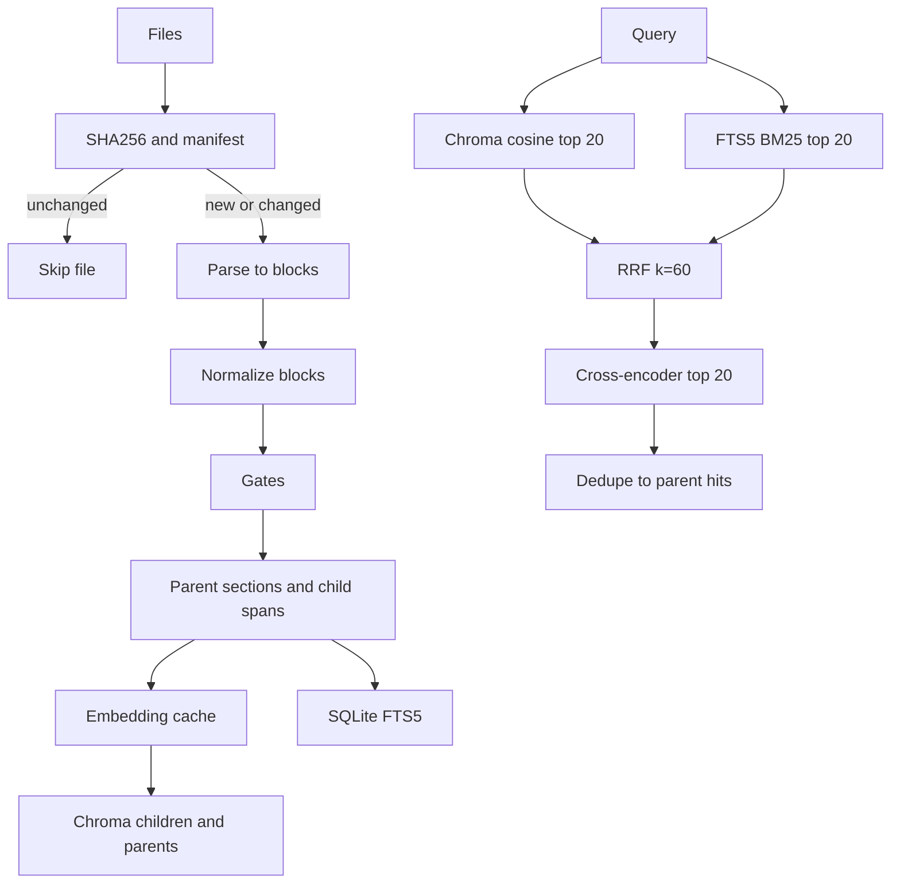

# Hybrid RAG pipeline

This is a new package in an empty repo. The product is a local ingest and retrieve library plus a CLI. No web server, no LangChain, no LlamaIndex, no RAGAS.

Using agent-reach (Exa search + Hugging Face model card + Chroma docs). Agent Reach is already on v1.5.0.

## What we are building

A person points the tool at a folder of files. It parses them, normalizes the text, cuts parent sections and smaller child spans, embeds only the children with a local model, and stores those vectors in Chroma. A query runs dense search and BM25, fuses the lists, optionally reranks, and returns the parent section with citation offsets. A golden-set command reports whether dense, BM25, fusion, or fusion-plus-rerank actually found the right passage.

Answer generation is not in this build. Retrieval is the part that silently goes wrong, and nothing in the request names a chat model. The CLI prints the parent text a generator would see, with file, version hash, heading, pages, and character span. Add a generator when there is a specific local model to call.

## Decisions, and what was rejected

**Indexing strategy: hybrid. Dense vectors in Chroma, BM25 in SQLite FTS5, fused with reciprocal rank fusion, then a local cross-encoder.** Measured writeups put dense-only recall@5 near 0.72 and hybrid-plus-rerank near 0.91 on domain text, because embeddings miss SKUs, error codes, and citations that BM25 hits. RRF (k=60) needs no labeled fusion weights. The reranker exists because fusion cannot read the query and the passage together. Only child spans are embedded and indexed. Parents are stored for lookup after a child wins.

Chroma’s `$contains` / `$regex` “full text search” is a case-sensitive filter, not a ranker. It cannot be the sparse leg. BM25 lives in a SQLite FTS5 table next to the Chroma directory (`unicode61`, no stemmer, no stopword list — stemming breaks identifiers).

**Rejected stores and models**

- BGE-M3 as the hybrid engine. Its dense scores trail Qwen3, and the sparse/ColBERT outputs need an index Chroma does not have. Building that index to use Chroma anyway is two systems.
- nomic-embed-text and MiniLM. Public long-text checks show them falling off past roughly a thousand characters, and MiniLM’s 256-token window is the truncation bug that shows up in real RAG postmortems. Parent sections must not be clipped by the embedder.
- API embedders. The request is local.
- Qwen3-Embedding-8B / 4B. Better MTEB scores, too heavy for a laptop ingest. Upgrade path is changing one model id after the golden set says 0.6B is missing recalls. 0.6B is already 1024-dim, 32k context, Apache-2.0, instruction-tuned, and the official path is `sentence-transformers`.
- Semantic chunking, late chunking, LLM proposition chunks. Semantic boundaries move when the model changes and they treat tables as sentences. Late chunking locks the embedder. Proposition chunks hide chunk bugs inside a generator.
- Neighbor expansion around a hit. The parent section is already the context window. Extra neighbors are how context gets noisy.
- OCR, pptx, xlsx. A PDF with no text layer fails the ingest with a clear error. Add those parsers when a real file needs them.

**Embedder:** `Qwen/Qwen3-Embedding-0.6B` through `SentenceTransformer`. Documents are encoded with no instruction. Queries use the model’s built-in `prompt_name="query"` (`Instruct: Given a web search query, retrieve relevant passages that answer the query`). Vectors are L2-normalized. Chroma HNSW space is cosine. Pin the Hugging Face revision at implementation time and write that string into collection metadata so a silent weight change cannot mix with cached vectors.

**Reranker:** `BAAI/bge-reranker-v2-m3` via `CrossEncoder`. It is a normal cross-encoder, so we do not hand-roll Qwen3-Reranker’s yes/no logit prompt. Loaded on the first query, not during ingest. Rerank the fused child list (top 20), then keep the first 5 distinct parents. The eval command turns this stage off so we can see if it earns its latency.

**Yes, sentence-transformers embeds each child.** Batches of 32. Parents are not embedded. Unchanged text is not re-embedded.

## Pipeline

One process, no queue. `ingest(paths)` walks files in order. A crash between “add new chunks” and “delete orphans” is fixed by running ingest again: it is idempotent.

## Formats and the block model

Supported suffixes: `.txt`, `.md`, `.html`, `.pdf`, `.docx`, `.csv`. Anything else raises. Cap at 50 MB.

Every parser returns the same block list. A block is a dataclass: `kind` (`prose`, `heading`, `list`, `table`, `code`, `row`), `text`, `heading_path`, `page` (0 when the format has no pages), `start_char`, `end_char` into the normalized document.

- Markdown: a small line parser for headings, fenced code, pipe tables, and paragraphs. Offsets stay in our code. No markdown library.
- HTML: stdlib `html.parser`. Drop `script`, `style`, `noscript`. `h1`–`h3` update `heading_path`. `p`, `li`, `pre`, and `table` become blocks.
- PDF: `pdfplumber` (MIT, via pdfminer). Page text plus extracted tables. Not PyMuPDF, which is AGPL. Repeated header/footer lines (same short line on more than half the pages) are dropped. No text layer raises `IngestError`, it does not index an empty success.
- DOCX: `python-docx` paragraphs, headings, and tables.
- CSV: stdlib `csv`. Each row is a block whose text repeats the header names, so a cell is searchable with its column.
- TXT: paragraphs split on blank lines. Heading path is the filename.

`doc_id` is the posix relative path from the ingest root. Two files with the same name in different folders stay distinct.

## Normalize

Per block, before chunking:

- Unicode NFKC, strip nulls and soft hyphens
- Join PDF line-break hyphenation (`letter-` + newline + lowercase letter)
- Collapse spaces inside a block, keep paragraph breaks
- Leave case, punctuation, and quotes alone so identifiers survive

Do not lowercase, stem, or strip stopwords on stored text. FTS may fold case; the stored passage stays as written.

## Chunking

**Chunking strategy: structure-first parent/child.** Headings, tables, and code decide the cuts. A token budget only packs what structure already grouped. Fixed windows, semantic similarity splits, late chunking, and LLM proposition chunks are not used.

Fixed 512-token windows are the wrong default: they cut sentences, split identifiers, and ignore headings. Token counts use this embedder’s tokenizer, not a character guess and not tiktoken.

Constants (one module, not a config system):

- Parent target 700 tokens, hard max 900
- Child target 180, hard max 280, overlap 40 tokens only when a parent must be split into several children
- Parent overlap of about 120 tokens only when one heading section exceeds the parent max, and only on a paragraph boundary
- Minimum: drop a block that is empty after normalize. Do not drop short chunks. Short lines are where error codes live

Algorithm:

1. Group consecutive blocks that share a `heading_path` into a section.
2. Pack the section into parents. A table or code block is atomic: if it fits, it is not merged into surrounding prose; if it exceeds the max, it is its own parent and is split further only by rows or lines, never mid-row.
3. Build children inside each parent. A short parent is one child covering the same span. Longer prose is packed on sentence boundaries (`[.!?]` plus newlines). Tables become header-plus-row-group children. Code is split on lines.
4. The string that is embedded and the string that is BM25-indexed are the same: `heading_path` plus a newline plus the child body. Chroma’s stored document is the body alone. `heading_path` is metadata, so citations do not print the heading twice.
5. Exact duplicate child strings inside one document keep the first span.

Child ids are content addresses: first 16 hex chars of `sha256(pipeline_version + doc_id + embed_text)`. Parent ids hash the parent body the same way. Re-ingesting an unchanged passage reuses the id.

## What gets stored

Directory `index/`:

- `chroma/` — two collections, persistent client, `hnsw:space=cosine`. We always pass vectors ourselves so Chroma’s default MiniLM function never runs.
- `side.sqlite` — FTS5, the file manifest, and the embedding cache. Chroma cannot rank BM25 or remember “this file hash is done”.

**Chroma collection `children`** (the only collection that is queried). Metadata is scalars only:

- `doc_id`, `parent_id`, `file_sha256`, `source_path`, `filename`, `mime`
- `heading_path`, `block_type`
- `start_char`, `end_char`, `page_start`, `page_end`
- `child_index`, `parent_index`, `token_count`, `pipeline_version`

**Chroma collection `parents`** is a get-by-id store, never a query target. Same citation fields, document is the parent body. Lookup after rerank is `collection.get(ids=...)`.

**`side.sqlite`**

- `files(doc_id, source_path, file_sha256, pipeline_version, model_id, model_revision)` — matching row skips the file
- `chunks_fts(chunk_id, doc_id, embed_text)` — FTS5
- `embeddings(model_id, model_revision, text_hash, vector blob)` — float32 bytes

Version replace, per file: if the sha256 and pipeline version and model revision match, skip. Otherwise embed missing children, upsert children and parents, replace that doc’s FTS rows, then delete Chroma ids for that `doc_id` that are not in the new id set. `file_sha256` on each record is the version a citation points at.

Collection metadata stores `model_id`, `model_revision`, `pipeline_version`, `dim`. Ingest refuses if the open index was built with a different triple. Rebuild is an explicit delete of the index directory, not a silent mix of vector spaces.

## Guardrails

Yes, but only the ones that stop a bad index or a bad citation. There is no chat model in this build, so a guardrail framework (NeMo, Llama Guard, toxicity classifiers, prompt-injection filters) does not belong. Those watch generated answers. We do not generate answers.

The guardrails are plain checks, not a plugin system:

- Stay inside the ingest root. A path that resolves outside that folder, including via symlink, is refused.
- Unknown suffix, file over 50 MB, unreadable file.
- PDF, DOCX, or HTML that yields no text fails the file. It is not indexed as an empty success.
- Zero chunks after normalize fails the file.
- More than 8000 chunks from one file fails the file (parser runaway).
- Open index model, revision, pipeline version, or vector dim does not match this process: ingest refuses. No mixing of vector spaces.
- Empty query is refused.
- Every hit returns the file hash, heading, page, and character span. A passage with no place to point at is not a result.
- Reranker scores are returned on the hit. We do not drop hits under a magic score cutoff. A cutoff hides weak-but-correct passages, and the golden-set eval is what decides if ranking is good enough.

Retrieved text is data. It is not instructions. When a generator is added later, that is the moment for an injection note and a score floor. Not before.

## Cache and gates

Cache, in order:

- Whole file skipped when the manifest matches
- Child vectors reused from `embeddings` when the text hash matches
- Query vectors: `functools.lru_cache` on the query encode function, max 128. No cache class

The checks in Guardrails are the gates. Each failed check raises `IngestError` or `QueryError` with the path and the reason.

## Retrieve

- Encode the query with `prompt_name="query"`
- Chroma `children` top 20 by cosine
- FTS5 `bm25` top 20
- RRF with k=60, rank starting at 1. A hit that only appears in one list still scores
- Cross-encoder scores those children
- Walk that order, emit a parent once, stop at 5
- Each hit carries parent text, heading, source path, file sha256, page range, char span, winning child id, and score
- If both lists are empty, return `[]` and do not call the reranker
- Optional `where` on `doc_id` for single-document questions

## Evals

No RAGAS. It needs a judge model and the score moves when the judge moves. This eval answers “did we fetch the passage?”

`evals/golden.jsonl` rows: `q`, `doc_id`, `must_contain`, `kind` (`lexical` or `semantic`). The lexical rows include an identifier that dense search should miss. The semantic rows paraphrase a sentence so BM25 should struggle.

Metrics: recall@5 (a returned parent contains `must_contain` in the right doc) and MRR. The command runs four modes and prints four lines: dense, bm25, rrf, rrf+rerank, split by `kind`.

Unit tests do not download weights. `encode` is a function argument. Tests pass a tiny deterministic function. A live check is `python -m rag eval` after the real model is downloaded, not a pytest default.

Shipped fixture corpus is a markdown file with a heading, a table, a code fence, a SKU, and a sentence that can be paraphrased. PDF and DOCX fixtures are built in the test with pdfplumber’s writer? pdfplumber does not write PDFs. Generate a one-page PDF with a tiny hand-written PDF byte string, and a docx with python-docx, so the parsers are tested without binary blobs in git.

## Package layout

Few files, one job each. Functions and dataclasses. No base classes, no factory, no settings object.

- [pyproject.toml](pyproject.toml) — Python 3.11+, deps: `chromadb`, `sentence-transformers`, `pdfplumber`, `python-docx`. Dev: `pytest`. Nothing else.
- [src/rag/models.py](src/rag/models.py) — `Block`, `Parent`, `Child`, `Hit`, errors, the numeric constants, `PIPELINE_VERSION`
- [src/rag/parse.py](src/rag/parse.py) — suffix dispatch and the six parsers
- [src/rag/normalize.py](src/rag/normalize.py)
- [src/rag/chunk.py](src/rag/chunk.py)
- [src/rag/embed.py](src/rag/embed.py) — load, batch encode, query prompt, sqlite blob cache
- [src/rag/store.py](src/rag/store.py) — Chroma open/upsert/delete, FTS, manifest
- [src/rag/retrieve.py](src/rag/retrieve.py) — dense, BM25, RRF, rerank, parent expand
- [src/rag/pipeline.py](src/rag/pipeline.py) — ingest, gates, skip-if-unchanged
- [src/rag/evaluate.py](src/rag/evaluate.py)
- [src/rag/cli.py](src/rag/cli.py) — `ingest`, `query`, `eval`
- tests beside those behaviors: normalize hyphenation and header drop, chunker leaves a table row intact and sets parent ids, RRF math, version replace deletes orphans, gates, parser offsets, eval recall on a fake ranker

Style: straight-line functions, names a person would use (`parent`, `child`, `embed_text`), comments only where a number has a ceiling (RRF k, parent not embedded, orphan delete is the crash window). Import only what the file calls.

## Build order

Each step lands with a failing test first, then the code, then `pytest` for that file. The fake embedder is introduced with the store tests so the suite never pulls Torch weights.